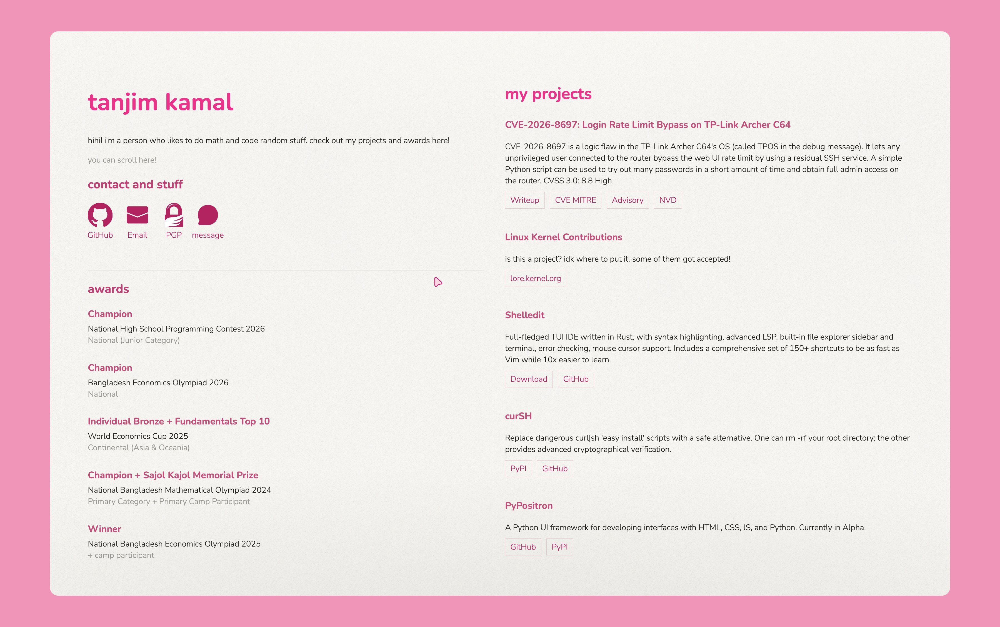

# my personal website!


this website uses a custom hand-rolled build system+framework. pushing to main automatically builds via the GitHub action `.github/workflows/build.yml` and deploys the optimized website to GitHub Pages.

**for whatever reason my VPS just mysteriously doesn't work in india so use [pages.tanjim.org](https://pages.tanjim.org) instead of [tanjim.org](https://tanjim.org). The messaging API is proxied so it doesn't cause any problems.** Thanks to @KavyanshKhaitan2 for pointing this out! (since im not in india)

## build system and framework
(in this specific website they are the same thing i put them in the same scripts)

- **You may have noticed that `index.html` is in the gitignore here.** This is intentional, this file is automatically generated. Edit `indext.html` to edit the layout of the website.
- the build system here operates on two scripts: `run.py` and `serve.py`.
- `run.py` uses indext.html then:
    - fills in the templates and repeats as needed
    - inlines all css, js and fonts
    - minifies everything into an optimized bundle
- `serve.py` uses `run.py` to run a dev server (default port 8000), which works exactly like something like `python -m http.server` for any paths except `/` or `/index.html`. If it is requested on those paths, it runs `run.py` (with the `stream` option which prints output to stdout rather than saving to a file and takes in index.html from stdin) and returns the output from that.

## messages

- the messaging system uses a backend hosted on 8051.proxy.tanjim.org using `backend.py`, it uses a REST API to handle the messages and when it receives a message, it stores it in a JSON file and sends an email to me using agentmail (because lazy).
- Every 5 minutes, a `launchd` .plist service on my MacBook checks for incoming messages, and notifies me of any messages. After it has successfully notified me, it marks the message as notified on the server. If it's locked, it waits until i unlock my MacBook to send me the message.
- `lilyterm.sh` is a script I source on my `.bashrc`. It provides a `lily` CLI for managing messages. When running interactively, it also notifies me in the terminal if any message has been sent. **Terminal notification intentionally does not trigger notified or read flags, and it uses the read flag instead of notified**.

## how to run

### backend

first, type the following to set up the .env and install the requirements:

```bash
cp .env.example .env
pip install -r requirements.txt
```

to set up the .env, you have to add your agentmail API key and inbox ID. go to [agentmail](https://www.agentmail.to/) to get your inbox, then set the variables like so:
- `AGENTMAIL_TOKEN`: the api token you got
- `AGENTMAIL_INBOX_ID`: your agentmail inbox email

(also note: if you are making your own personal site forking this, the to email is hardcoded in backend.py for now. make sure to change that otherwise all messages will be emailed to me!)

now you can just:

```bash
python3 backend.py
```

### frontend

first, you have to install the requirements to use this:

```bash
pip install -r requirements.txt
```

**to generate the optimized `index.html`:**

```bash
python3 run.py
```

alternatively, you can do:

```bash
cat indext.html | python3 run.py stream > index.html
```

**to run a dev server (default: port `8000`):**

```bash
python3 serve.py
```

## license

MIT, but the custom cursor SVGs (`cursor.svg`, `textc.svg`, `hand.svg`) are GPL licensed as they are based from [Bibata Cursor](https://github.com/ful1e5/Bibata_Cursor).

